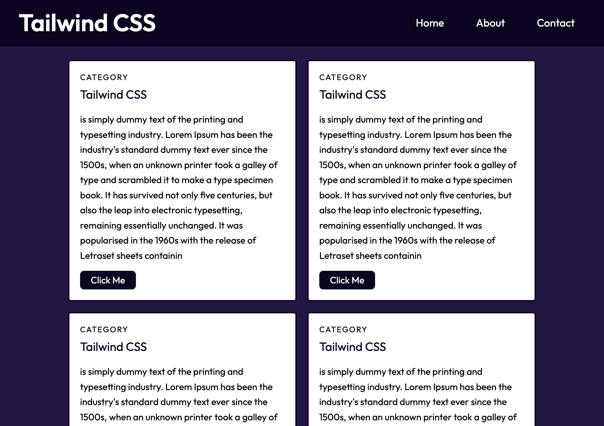

# tailwind-css-example
An Example on the use of Tailwind CSS library

Checkout the live website [here](https://github.com/mohamedallam13)



### Built With

* HTML5
* CSS3
* Tailwind CSS
* Node.js
* npm
* Netlfiy

## Features

* Static website built with Tailwind CSS library
* Tailwind CSS installed through npm
* Config file modified to give unique look to the website

### Installation


Following are the steps of installation

```
npm i
```

## Questions 

If you have any more questions, please contact me here:

Github Username: [mohamedallam13](https://github.com/mohamedallam13)

Email: [mohamedallam.tu@gmail.com](mailto:mohamedallam.tu@gmail.com)


